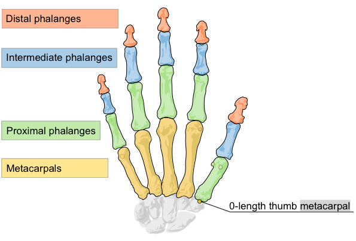

# API Overview

Leap Motion系统识别并追踪手部、手指和类似手指的工具。这个设备拥有清晰准确高质量的追踪帧率，同时可以分别反馈不同的位置、手势、动作的信息。

> The Leap Motion system recognizes and tracks hands, fingers and finger-like tools. The device operates in an intimate proximity with high precision and tracking frame rate and reports discrete positions, gestures, and motion.

LM控制器拥有光学传感器和红外线。当控制器处于它的标准位置上时，这些传感器指向为沿y轴向上，监测视野到达大约150度。LM控制器有效范围大约为设备上方的25毫米到600毫米范围（1英寸到2英尺之间）。

>The Leap Motion controller uses optical sensors and infrared light. The sensors are directed along the y-axis – upward when the controller is in its standard operating position – and have a field of view of about 150 degrees. The effective range of the Leap Motion Controller extends from approximately 25 to 600 millimeters above the device (1 inch to 2 feet).

当被监测物有清晰、高对比度的轮廓时，传感器的监测和追踪功能会达到最佳的工作状态。LM软件会结合传感器数据和内部人手模型来帮助解决监测追踪时遇到的问题。

> Detection and tracking work best when the controller has a clear, high-contrast view of an object’s silhouette. The Leap Motion software combines its sensor data with an internal model of the human hand to help cope with challenging tracking conditions。

## Coordinate system 坐标系统

LM系统使用一个右手笛卡尔坐标系。它的原点为LM控制器顶面的中心点。X轴和Z轴位于水平面，其中X轴与控制器的长边平行。Y轴是垂直的，向上方向为正方向（这与绝大多数的计算机图形系统的坐标系统是相反的，它们的正方向为向下）。z轴的正方向指向用户所处的位置（注：即用户面向的方向为负，向用户后背的方向为正）。

> The Leap Motion system employs a right-handed Cartesian coordinate system. The origin is centered at the top of the Leap Motion Controller. The x- and z-axes lie in the horizontal plane, with the x-axis running parallel to the long edge of the device. The y-axis is vertical, with positive values increasing upwards (in contrast to the downward orientation of most computer graphics coordinate systems). The z-axis has positive values increasing toward the user.

The Leap Motion right-handed coordinate system.

LM API 测量的物理量的单位如下： 
The Leap Motion API measures physical quantities with the following units:

+ Disance: millimeters
+ Time: microseconds (unless otherwise noted)
+ Speed: millimeters/second
+ Angle: radians

## Motion tracking data 动作追踪数据

当LM控制器在视野范围内追踪手部、手指和工具时，它以帧为单位更新一套数据。每个Frame object 代表一帧，其中包含监测实体的列表，比如手部、手指、工具以及识别到的手势和描述场景中整体动作的因素。Frame object 可谓是LM数据模型的根基。

> As the Leap Motion controller tracks hands, fingers, and tools in its field of view, it provides updates as a set – or frame – of data. Each Frame object representing a frame contains lists of tracked entities, such as hands, fingers, and tools, as well as recognized gestures and factors describing the overall motion in the scene. The Frame object is essentially the root of the Leap Motion data model.
To read more about Frames, see [Frames](https://developer.leapmotion.com/documentation/python/devguide/Leap_Frames.html).

### Hands

手部模型提供了手的各种信息，包括手的识别（左右手）、位置、和其他一些特征，这只手连接的胳膊，以及这只手上的手指的列表。

> The hand model provides information about the identity, position, and other characteristics of a detected hand, the arm to which the hand is attached, and lists of the fingers associated with the hand. 

Hands are represented by the **Hand** class.

手的`palm_normal`和 `direction` 向量定义了手的朝向。

> The Hand **palm_normal** and **direction** vectors define the orientation of the hand.

LM软件利用人类手部内模来对手不可见的部分进行预测追踪。手部模型始终会给出五个手指的位置，尽管只有在手和手指的轮廓是清晰可见时的追踪才是最佳的。软件利用了手的可见部分、手内膜以及先前的数据来计算出不可见部分可能性最高的所处位置。要注意的是手指细微动作对于LM传感器来说不太可能被监测到。`Hand.confidence`值表明了当前监测数据与手内模型的匹配程度。 
如果有不只一个人出现在视野中，那手列表中包含的手也会不只是两只。但是，我们建议为了达到最佳的追踪质量，还是最多只让两只手出现在视野里比较好。

> The Leap Motion software uses an internal model of a human hand to provide predictive tracking even when parts of a hand are not visible. The hand model always provides positions for five fingers, although tracking is optimal when the silhouette of a hand and all its fingers are clearly visible. The software uses the visible parts of the hand, its internal model, and past observations to calculate the most likely positions of the parts that are not currently visible. Note that subtle movements of fingers tucked against the hand or shielded from the Leap Motion sensors are typically not detectable. A Hand.confidence rating indicates how well the observed data fits the internal model. 
More than two hands can appear in the hand list for a frame if more than one person’s hands or other hand-like objects are in view. However, we recommend keeping at most two hands in the Leap Motion Controller’s field of view for optimal motion tracking quality.

### Arms

手臂是类骨对象，它包括指向、长度、宽度、手臂的端点。当肘不在视野中时，LM控制器会基于它先前的数据和人体参数来估测建立出它的位置。

> An Arm is a bone-like object that provides the orientation, length, width, and end points of an arm. When the elbow is not in view, the Leap Motion controller estimates its position based on past observations as well as typical human proportion.

### Fingers

LM控制器可以给出一只手上每一根手指的数据。如果某个手指部分或全部不可见，这个手指的特征会被估测出来，基于先前数据和手部解剖模型。根据名字来区别特定手指，如 拇指、食指、中指、无名指、小拇指。

> The Leap Motion controller provides information about each finger on a hand. If all or part of a finger is not visible, the finger characteristics are estimated based on recent observations and the anatomical model of the hand. Fingers are identified by type name, i.e. thumb, index, middle, ring, and pinky.

Fingers are represented by the **Finger** class, which is a kind of **Pointable** object.

手指的`tip_position`和`direction`向量表明来指尖的位置和手指指向的大致方向

> Finger **tip_position** and **direction** vectors provide the position of a finger tip and the general direction in which a finger is pointing.

一个Finger对象给出了一个Bone对象，表明了每个手指上的每个解剖学上的骨头的位置和指向。

> A Finger object provides a Bone object describing the position and orientation of each anatomical finger bone. All fingers contain four bones ordered from base to tip.

骨头被分为 The bones are identified as:

+ Metacarpal – the bone inside the hand connecting the finger to the wrist (except the thumb)
+ Proximal Phalanx – the bone at the base of the finger, connected to the palm
+ Intermediate Phalanx – the middle bone of the finger, between the tip and the base
+ Distal Phalanx – the terminal bone at the end of the finger

这个模型中的大拇指和标准解剖模型的命名不太一样。真实的大拇指比其他的手指少一根骨头。但是，为了程序的方便，LM的模型中的大拇指包括了一个0长度的掌骨，以便大拇指的骨头索引与其它手指是相同的。这样的结果就是大拇指的解剖学里的名字根LM模型中的都对不上号，详细情况看一眼图示就明白了。

> This model for the thumb does not quite match the standard anatomical naming system. A real thumb has one less bone than the other fingers. However, for ease of programming, the Leap Motion thumb model includes a zero-length metacarpal bone so that the thumb has the same number of bones at the same indexes as the other fingers. As a result the thumb’s anatomical metacarpal bone is labeled as a proximal phalanx and the anatomical proximal phalanx is labeled as the intermediate phalanx in the Leap Motion finger bone model.(Original diagram by [Marianna Villareal](http://commons.wikimedia.org/wiki/File:Scheme_human_hand_bones-en.svg).)

### Tools
tool is an object like a pencil.

Tools are represented by the **Tool** class, which is a kind of **Pointable** object.

工具比手指长、细、直。
只有细且圆柱形的物体才会被认为是工具。
在v2中，tools是独立于hand的。

> A tool is longer, thinner, and straighter than a finger.
Only thin, cylindrical objects are tracked as tools.
Note that as of version 2, tools are independent of hands.

### Gestures

LM软件可以识别表示用户指令的特定运动模式如手势。每个手指和工具的手势都能被分别检测到。LM软件会像反馈其它运动追踪数据（比如手和手指）一样在一帧里反馈手势到监测信息。

> The Leap Motion software recognizes certain movement patterns as gestures which could indicate a user intent or command. Gestures are observed for each finger or tool individually. The Leap Motion software reports gestures observed in a frame the in the same way that it reports other motion tracking data like fingers and hands.

Gestures are represented by the **Gesture** class and its subclasses, **CircleGesture**, **KeyTapGesture**, **ScreenTapGesture**, and **SwipeGesture**.

下列运动模式可以被LEAPMOTION识别：

Circle — A finger tracing a circle.

 Swipe — A long, linear movement of a hand and its fingers.

 Key Tap — A tapping movement by a finger as if tapping a keyboard key.

 Screen Tap — A tapping movement by the finger as if tapping a vertical computer screen.

**注意**：在为你的应用使用手势之前，你必须确保你要用的每一个手势都能被识别。Controller class里有 enableGesture() 可以用来使你想用的手势能被识别。

> **Important**: before using gestures in your application, you must enable recognition for each gesture you intend to use. The Controller class has an enableGesture() method that you can use to enable recognition for the types of gestures you use.

### Motions

用户手部在某一段时间的变化被归为基本的动作种类，运动就是依据这些基本动作种类被估测出来的。运动包括缩放、旋转、移位（位置变化）。
> Motions are estimates of the basic types of movements inherent in the change of a user’s hands over a period of time. Motions include scale, rotation, and translation (change in position).

运动是在两帧之间被计算出来的。你可以从一个Frame object里获得一个场景的全部运动因素。你也可以从一个Hand object获得与单独一只手有关的运动因素。

> Motions are computed between two frames. You can get the motion factors for the scene as a whole from a Frame object. You can also get factors associated with a single hand from a Hand object.

你可以用反馈的运动因素来为你的程序设计交互方式。比如，你可以计算两帧之间的缩放因素来让用户改变物体的大小，而不是用很多帧的数据来追踪每一个手指的位置变化。

> You can use the reported motion factors to design interactions within your application. For example, instead of tracking the change in position of individual fingers across several frames of data, you could use the scale factor computed between two frames to let the user change the size of an object.

|Motion Type|Frame|Hand|
|:--|:--|:--|
|缩放Scale|帧缩放反映了场景物体之间相互接近或远离的运动。比如一只手向另一只手靠近。Frame scaling reflects the motion of scene objects toward or away from each other. For example, one hand moves closer to the other.|手缩放反映了手指开合的变化。Hand scaling reflects the change in finger spread.|
|旋转Rotation|帧旋转反映了场景内物体的差异运动。比如一只手往上另一只手往下。Frame rotation reflects differential movement of objects within the scene. For example, one hand up and the other down.|手旋转反映了一只手的朝向的变化。Hand rotation reflects change in the orientation of a single hand.|
|移位Translation|帧移位反映了场景内所有物体的平均位置变化。比如两只手抖向左移、上移、前移。Frame translation reflects the average change in position of all objects in the scene. For example, both hands move to the left, up, or forward.|手移位反映了这只手抖位置改变。Hand translation reflects the change in position of that hand.|

### Sensor Images

得到追踪数据的同时你也可以得到LM的摄像头拍摄到的原始图像。

> Along with the computed tracking data, you can get the raw sensor images from the Leap Motion cameras.

A raw sensor image with superimposed calibration points.

图像数据包括测量的IR明度值和用来修正复合镜片变形的校准数据。你可以把传感图像应用于现实增强，尤其是当LM硬件和VR头戴设备协作时。

> The image data contains the measured IR brightness values and the calibration data required to correct for the complex lens distortion. You can use the sensor images for augmented reality applications, especially when the Leap Motion hardware is mounted to a VR headset. 
For more information, see [Camera Images](https://developer.leapmotion.com/documentation/python/devguide/Leap_Images.html).
