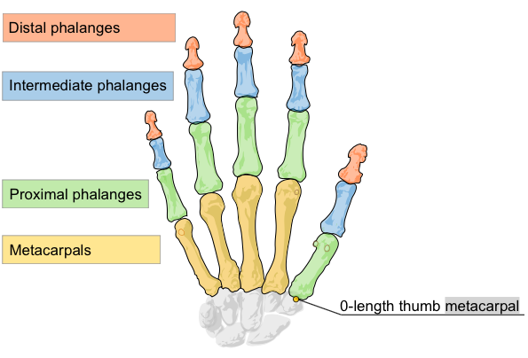

# 骨骼追踪模型介绍 Introducing the Skeletal Tracking Model

2.0版的leap motion API 有个新的骨骼追踪模型，这个模型可以获取更多的手部和手指的数据同时还改善了整体的追踪数据
> Version 2.0 of the Leap Motion API introduces a new skeletal tracking model that provides additional information about hands and fingers and also improves overall tracking data.

通过人体手部建模，Leap Motion软件可以更好地在不够清晰的环境中预测手指和手部的位置。一只手始终可以显示五根手指，两只手可以在相互交叉的过程中也被追踪到。当然，控制器依然必须要能监测到一个手指或者手部才可能精确地获取位置。当设计你的应用程序的交互行为时必须要始终注意这一点。避免复杂的手势或者非常精细的动作，尤其是那些要求不伸开的手指的动作。

> By modeling a human hand, the Leap Motion software can better predict the positions of fingers and hands that are not clearly in view. Five fingers are always present for a hand and hands can often cross over each other and still be tracked. Of course, the controller still needs to be able to see a finger or hand in order to accurately report its position. Keep this in mind when designing the interactions used by your application. Avoid requiring complex hand “poses” or subtle motions, especially those involving non-extended fingers.

*Explore the behavior of the new hand model in the Diagnostic Visualizer*

API的变化可能不想你想象的那么大，之前的API类依然跟以前的用法一样，不论你是否使用了新功能。

>The API changes are not as dramatic as you might expect and existing API classes still work mostly the same whether or not you use the new features.

The additions include:

+ 基于内部手模型和监测数据的关联性报告两者切合度的数值（下文中有详细解释hand confidence的概念）(Reporting of a confidence rating based on the correlation between the internal hand model and the observed data)
+ 判定左右手(Identification of right or left handedness)
+ 判定手指(Identification of digits)
+ 报告每一个手指骨头的位置和指向(Reporting of the position and orientation of each finger bone)
+ 报告手握因素，来显示用户是在捏还是抓握(Reporting of grip factors indicating whether a user is pinching or grasping)
+ 报告每一只手的五个手指(Reporting of five fingers for each hand)
+ 报告一根手指是否伸开(Reporting whether a finger is extended or not)

可能相比之前最明显的变化是对手部手指连续性（持续性）追踪的提升。这个改变能让各种LM app的可用性获得提升。但是，如果你依赖于手指弯曲时消失或者手指触摸，那你必须得修改一下。比如，如果你要计算可见的手指或者判断手指的伸出或弯曲，你得使用新的|Pointable_isExtended|_ 手指属性来获知手指是否伸出。另一方面，如果你依赖于手指互相接触时的消失，你就得设立一个两指之间最小距离下限，因为手指不会再消失了==! 
注意：Finger.joint_position()在之后的SDK中会被移除（）

> Perhaps the most significant change for existing applications is the improved persistence of hands and fingers. This should improve the usability of most Leap Motion-enabled apps. However, if you relied on fingers disappearing when curled into the hand or when they touched, then you may have to make some changes. For example, if you count visible fingers or otherwise distinguish between fingers extended outward and those retracted toward the hand, you will have to use the new |Pointable_isExtended|_ finger properties to know which fingers are extended or not. If, on the other hand, you relied on fingers disappearing when they touched each other, then you will have to establish a minimum distance threshold between the finger tips instead, since the fingers will no longer disappear.
> Note: Finger.joint_position() will be removed (in favor of the Bone class) in an upcoming SDK release.

## python的新的追踪API
在新的追踪模型中，API的变化包括以下：

### Hand class:
+ Hand.confidence
+ Hand.is_left
+ Hand.is_right
+ Hand.grab_strength
+ Hand.pinch_strength
+ Hand.palm_width
+ Hand.basis
+ Hand.arm

`Hand.confidence`，一个0到1之间的值，表明了手内模型和监测数据的匹配度。数值较低表明有明显的差异；手指位置，甚至手部判定很可能不正确。confidence这个值对于你的程序的意义很多变。尽管没有一个很高的confidence值，手势和动作也可以是有效的。另一方面，你应该确保在执行由某些手势或手部属性触发的程序事件之前，confidence值足够高。

> **Hand.confidence**, a value between 0 and 1, rates how well the internal hand model fits the observed data. A low value indicates that there are significant discrepancies; finger positions, even hand identification could be incorrect. The significance of the confidence value to your application can vary with context. Gestures and motions can be valid even without a high confidence in the hand data. On the other hand, you should make sure the confidence value is high before triggering significant application events based on postures or hand properties.

`Hand.is_left` 和 `is\_right`。它们中总有一个为true。但是，LM控制器需要监测到足够的手部信息来得出一个准确的定义。比如，如果你把你紧握的拳头放到控制器的视野里，软件很有可能会计算出错误的结果。如果软件意识到它对手的判断出现了错误，则当前这只手会被一个有新ID的Hand object替代（以及正确的手指识别）

> **Hand.is\_left** and **is\_right** are self explanatory. One of these will always be true. However, the Leap Motion controller needs to see enough of the hand to make an accurate classification. If, for example, you put your closed fist into the controller field of view, the software has very little to go on and may come to the wrong conclusion. If the software realizes it has misclassified a hand, the current hand is replaced with a Hand object having a new ID value (and corrected finger identification).

`Hand.grab_strength` 和 `pinch_stength` 属性都是0到1之间的值，表明了你的手是否是捏(pinch)或抓(grab)的姿势。力量(strength)值接近0说明手是平的，手指伸开。对于抓来说，力量值增加到1说明你把手握成了拳头。对于捏来说，力量值增加说明你正在把大拇指和其他某个手指捏在一起。在你的程序中，当这些力量属性的值到达一定数值，你可以来触发一些行为或进行选择。

>The **Hand.grab\_strength** and **pinch\_strength** properties are values between 0 and 1, indicating whether your hand is in a pinching or grabbing posture. A strength value is close to zero for a hand with flat, extended fingers. For a grab, the strength increases toward 1.0 as you curl your fingers into a fist. For a pinch, the strength increases as you curl the thumb and any finger toward each other. You can use these strength properties to trigger grabs or selections in your application when the value exceeds a certain threshold.

`Hand.palm_width` 给出了一个对于当手处于平放状态时的手掌宽度的估测。`Hand.basis` 是一个方便的方法用来获得定义手的朝向的标准正交基向量(orthonormal basis vectors)。这三个向量在基矩阵(basis matrix)中分别为手掌法线(palm normal)、手方向(hand direction)、以及它俩的向量积(cross product)。

> **Hand.palm\_width** provides an estimation of the width of the palm when the hand is in a flat position. **Hand.basis** is a convenience method for getting the orthonormal basis vectors defining the orientation of the hand. The three vectors in the basis matrix are the palm normal, the hand direction, and the cross product between them.

`Hand.arm` 给出了有关与手相接的前臂的信息。这个属性是根据人体解剖学被估算出来的，然而整个前臂并没有全部进入监测范围。

> **Hand.arm** provides the information about the forearm to which a hand is attached. The properties of the forearm are estimated based on typical human anatomy when the entire forearm is not in view.

### PointableList and FingerList classes:

+ PointableList.extended()
+ FingerList.extended()
+ FingerList.finger_type()

这个延伸功能返回当前正在伸开的手指的列表的数值。其中包括那些或多或少有指向性的手指以及任何“工具”。`finge_type()`功能返回一个包含所有某类手指的列表（比如所有小拇指、所有食指等）。

> The extended functions return the members of the current list that are considered extended. This includes fingers that are more or less pointing straight out from the hand and, in the case of a **PointableList object**, any tools in the list. The **finger_type()** function returns all fingers in a list of the specified finger type (i.e all pinkies, all index fingers, etc).

### Pointable and Finger classes:

+ Finger.type
+ Finger.bone()
+ |Pointable.isExtended|_

`Finger.type` 功能判定手指的名称。返回的数值为[0,4]的整数，代表大拇指、食指、中指、无名指、小拇指。`Finger.bone()` 功能返回 Bone object 表示手指上的某一个骨头。每一个手指，包括拇指，都有四块骨头——包括拇指（即使它在解剖学上只有三块骨头）。

> The **Finger.type** function identifies the finger name. The values returned are an enumeration, [0..4], representing: thumb, index, middle, ring, and pinky. The **Finger.bone()** function returns the Bone object representing the specified bone of a finger. Each digit, including the thumb, has four defined bones – including the thumb (even though it only has three anatomical bones).

`|Pointable.direction|_` 平行于指根指尖连线。它不一定平行于这个手指的最后一根骨头(the distal phalanx)。一根手指越弯曲，这两者的偏差越大。这个计算Pointable.direction的方法和早期版本API中是一样的，但是如果你从一个表示手的地方沿着Pointable.direction发射一道射线，这看起来有点怪异。

> Note that **|Pointable.direction|_** is parallel to the line running between the base and the tip of the finger. It is not necessarily parallel to the last bone of the finger (the distal phalanx). The more a finger is curved, the greater the difference between the two directions will be. This method of calculating Pointable.direction is consistent with earlier versions of the API, but may look odd if you project a ray from a visual representation of the hand along the **|Pointable.direction|**.

### New Bone class:

Bone class 描述了手指上每一个骨头的位置和指向（包括掌骨metacarpal bone，它连接了手指和手掌根部）。

> The Bone class describes be position and orientation of each of the bones of a finger as well as the metacarpal bones, which connect the fingers to the base of the hand. 

+ Bone.basis
+ Bone.direction
+ Bone.invalid
+ Bone.is_valid
+ Bone.length
+ Bone.prev_joint
+ Bone.next_joint
+ Bone.type
+ Bone.width

### New Arm class

Arm class，与Bone class类似，给出了前臂终点的物理位置以及基坐标（具体描述了手臂在空间中的指向）。

> The Arm class, similar in structure to the Bone class, provides the physical positions of the end points of the forearm as well as basis vectors specifying how the arm is oriented in space.

+ Arm.basis
+ Arm.direction
+ Arm.elbow_position
+ Arm.invalid
+ Arm.is_valid
+ Arm.width
+ Arm.wrist_position

### JSON data changes

新的追踪模型也可以通过LM WEBSOCKET界面来反映追踪数据。就像原生API，你可能注意到的于之前最大的不同就是现在的手始终有5根手指了。 
想看API新功能，v6.json endpoint(ws://127.0.0.1:6437/v6.json)

> The new tracking model is also reflected in the tracking data supplied via the Leap Motion WebSocket interface. As with the native API, the biggest difference you are likely to notice in existing applications is that hands will always have 5 fingers now. 
To access the new API features, use the v6.json endpoint (ws://127.0.0.1:6437/v6.json).

在一帧的手的数组中的每只手都有以下属性 Each hand in the frame hands array has the following new properties:

+ `armWidth` – the average width of the forearm.前臂的平均宽度。
+ `confidence` – indicates how well the skeleton model and the observed data fit.表示了骨骼模型和监视数据的切合度。
+ `elbow` – the position of the elbow of the arm to which the hand is attached 胳膊和手的连接处的位置。
+ `grabStrength` – a value between 0 and 1.一个在0到1之间的值。
+ `pinchStrength` – a value between 0 and 1.一个在0到1之间的值。
+ `type` – a string indicating whether the hand is a left or a right hand.一个表明这只手是左手还是右手的字符串。
+ `wrist` – the position of the wrist 腕关节的位置。

在一帧的可指向物的数组中的每一个手指都有以下属性 Each finger in the frame pointables array has the following new properties:

+ `type` – an integer code for the finger name.一个表示手指名称的整数
+ `bases` – the basis vectors for each bone, in index order (wrist to tip).每个骨头的基向量，索引顺序从手腕到之间。
+ `btipPosition` – position of the extreme end of the distal phalanx as an array of 3 floating point numbers.第三指骨节(distal phalanx)的最远端的的位置，得到一个包含三个浮点数的数组。
+ `carpPosition` – position of the base of metacarpal bone as an array of 3 floating point numbers.掌骨（metacarpal bone）基点的位置，得到一个包含三个浮点数的数组。
+ `dipPosition` – position of the base of the distal phalanx as an array of 3 floating point numbers.第三指骨节的基点的位置，得到一个包含三个浮点数的数组。
+ `pipPosition` – a position vector as an array of 3 floating point numbers 一个包含三个浮点数的位置向量。
+ `mcpPosition` – a position vector as an array of 3 floating point numbers 一个包含三个浮点数的位置向量。
+ `extended` – a boolean indicating whether the finger is pointing or not. 一个表示某根手指是否正在指向外的布尔量